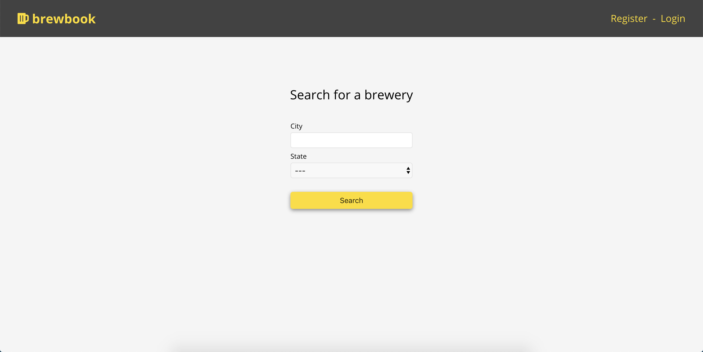

This project was created by Steven Thornton

# Brewbook

## Authors

- Steven Thornton

## Links

- [Live app](https://brewbook-app.now.sh/)
- [Link to server repo](https://github.com/Stevenwthornton0/Brewbook_server)

## Demo Account
```
username: dunder
password: password
```

## Screenshots
### Desktop view



 
### Mobile view


## Summary

Brewbook is a psuedo social-media application that allows users to search for breweries in any U.S. city, find information on that brewery, and leave a review on that brewery's page.

## Technologies
- React
- HTML 5
- CSS3
- Jest/Enzyme

